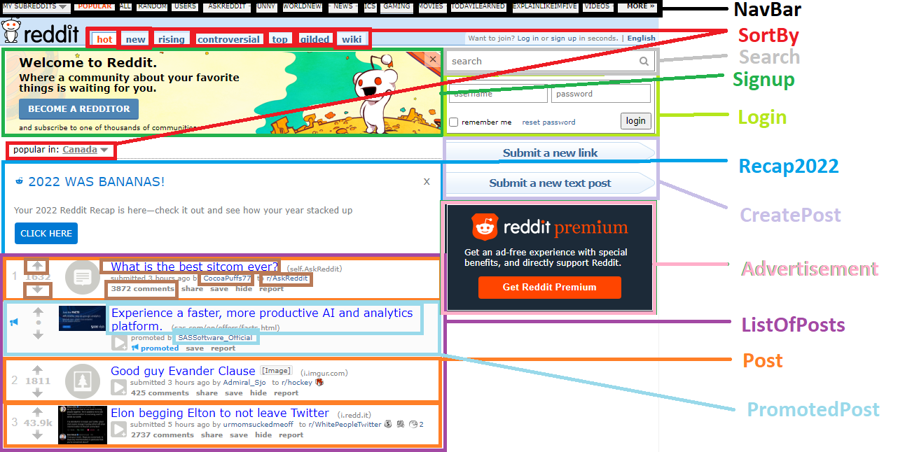

# React Architecture Report

>This report will be written on the old Reddit home page. Which can be reached at [old.reddit.com](https://old.reddit.com/)

## Start with a mockup


### Functionality on this page:

- Navigating subreddits
- Sort by hot/new/rising/etc. tabs
- Search reddit
- Login with username/password
- Signup to Reddit
- Advertising link
- Submit new link
- Submit new text post
- Upvote/Downvote post
- Click on post
- Click on profile of OP

The JSON API may look something like this:
```json
[
    {
        "user":{
            "name": null,
            "followedSubreddits":{
                "subreddit": "blablabla",
                "subreddit": "blablabla2"
            },
        }
    }
    {
        "subreddit": "popular",
        "sortby":{
            "sort": "hot",
            "country": "Canada"
        },
        "post":{
            "id": "1",
            "title": "What is the best sitcom ever?",
            "op": "CocoaPuffs77",
            "subreddit": "AskReddit",
            "upvotescore": 1632,
            "comments": 3872
        },
        "ad":{
            "id": "1",
            "title": "Experience a faster, more productive AI and analytics platform.",
            "op": "SASSoftware_Official"
        },
        "post":{
            "id": "2",
            "title": "Good guy Evander Clause",
            "op": "Admiral_Sjo",
            "subreddit": "hockey",
            "upvotescore": 1811,
            "comments": 425
        },
        "post":{
            "id": "3",
            "title": "Elon begging Elton to not leave Twitter",
            "op": "urmomsuckedmeoff",
            "subreddit": "WhitePeopleTwitter",
            "upvotescore": 43924,
            "comments": 2737
        }
    }
]
```

---

## Break the UI into a component hierarchy



### Component Breakdown

- NavBar (props: followedSubreddits)
  - MySubredditsList Button
  - Subreddit Button
  - MoreSubreddits Button
- SortBy (props: none)
  - Sort Buttons
  - Country Button
- Signup (props: signupurl)
- Search (props: none)
- Login (props: user, pass)
- Recap (props: user)
- CreatePost (props: postType)
  - SubmitLink Button
  - SubmitText Button
- Advertisement (props: none)
- ListOfPosts (props: user, subreddit, sort, country)
  - Post (props: user, comments, upvotes, postlink, subreddit)
    - Upvote Button
    - Downvote Button
    - Post Link
    - Subreddit Link
    - OP Link
  - PromotedPost (props: user)
    - Upvote Button
    - Downvote Button
    - Post Link
    - OP Link

---

## Minimal representation of state

> ### Note:
> - If it is unchanged over time - not state
> - If it is passed in from a parent via props - not state
> - If it can be computed based on existing state or props in component - not state

Based on the breakdown above, the following is a minimal representation of state:
- Search is a stateful value, as it passes all of the notes above. The stateful variable will start as "" and be updated to include whatever the user types in.
- SortBy is a stateful value, as it passes all of the notes above. A method of filtering needs to be chosen (hot/new/controversial/etc.) and choosing a new value will update the stateful variable.

I believe this is the extent of the stateful variables that would be used on this site.